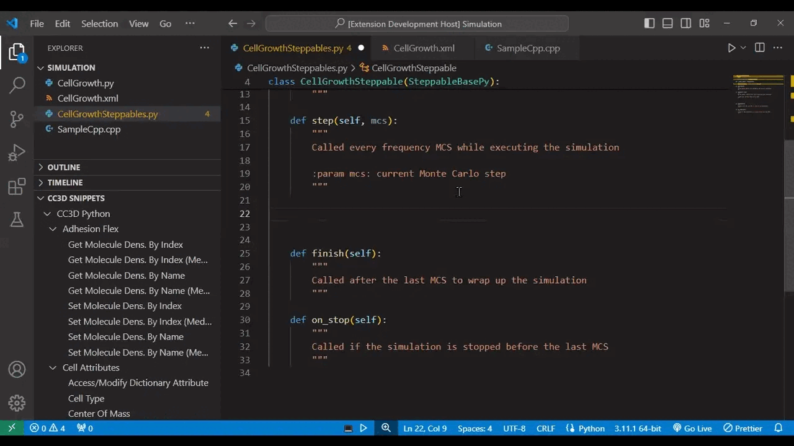

# CompuCell3D Snippets

This official plugin for CompuCell3D (CC3D) includes more than 300 code snippets to help you write simulations in Python and XML as well as develop C++ plugins.

CompuCell3D publishes open-source virtual tissue modeling software that enables scientists to fill gaps in experimental data, educate communities, and accelerate discoveries by simulating biological phenomena.
https://compucell3d.org/

You can use our specialized editor, Twedit++, or this VSCode plugin to develop simulations. 

## Features

As you type in a `.py`, `.xml`, or `.cpp` file with this extension enabled, VSCode will suggest code snippets to auto-complete with. 

You can also find all of the snippets in the CC3D Snippets menu. Double-click a snippet or click the blue arrow to the right of it to insert it. 

## Extension Settings

`Show Only Relevant Snippets In Menu`: 
  * When set to `true` (*default*): As you edit Python/XML/C++ files, this setting will show only snippets in the tree menu that correspond to the programming language you're using. 
  * When set to `false`: All snippets will be shown in the menu regardless of the language. This will also prevent you from losing your place as you browse. 

## Getting Help

If you have any challenges, suggestions, or feedback for this extension, we'd be happy to help on Reddit: 
https://www.reddit.com/r/CompuCell3D 
